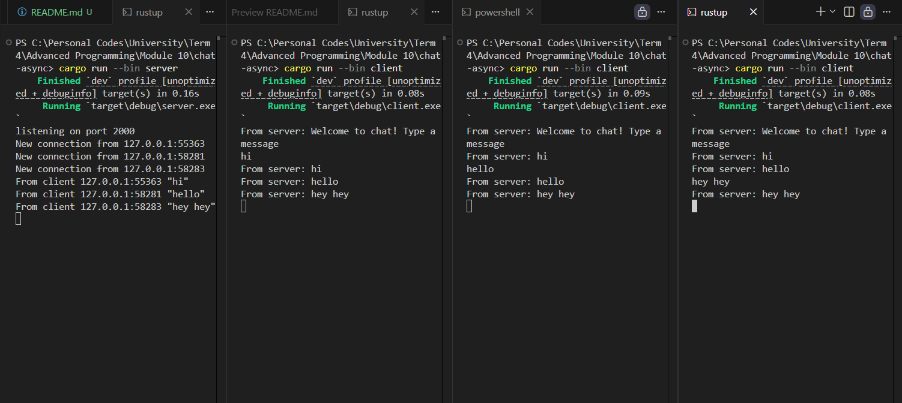
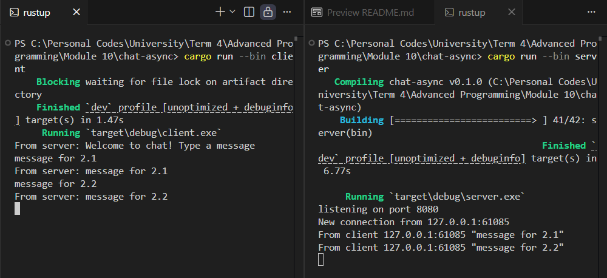
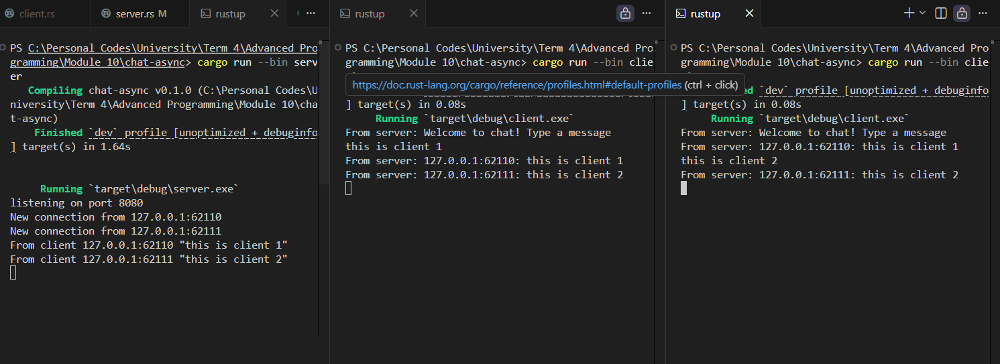

# Module 10 - Asynchronous Programming



Here, the server infinitely loops to receive messages from clients. When a new client connects, the server doesn't stop its process just to talk to that specific client. Instead, it spawns an async block that handles the connection and gives it to the Tokio executor. This allows the server to go back and listen for new connections while the said client's task is bing handles asynchronously. 

Before making the async task, the server first creates a single channel: `let (bcast_tx, _) = channel(16);` which is going to be used by every client, since the server hands a clone of this channel to the async task. When a client connects to the server, the client is automatically subcribed to that channel: `bcast_tx.subscribe()`. So, when 3 clients connects to the server, there are 3 subscribers connected to this broadcast channel.

When any client sends a message to the server, the message is duplicated and every copy of it is sent to every active subscriber. This means, this specific client's message will also appear in other active clients too, in the form of `From server: [the message]`.

-----
To change the port to 8080, I must do this first:
- in server.rs:
    ```Rust
    let listener: TcpListener = TcpListener::bind("127.0.0.1:8080").await?;
    ```
- in client.rs:
    ```Rust
    ClientBuilder::from_uri(Uri::from_static("ws://127.0.0.1:8080"))
            .connect()
            .await?;
    ```
This allows the server and client to be on the same port, therefore establishing a proper connection. It still uses the WebSocket protocol even after this port change, since the `ws://` is still there. On the server side, this is wrapped using the Tokio ServerBuilder.


-----
The next experiment includes the sender's IP address and port number in every broadcasted message. To achieve this, I made these changes to the server's handle connection:
```Rust
if let Some(text) = msg.as_text() {
    println!("From client {addr:?} {text:?}");
    // Added addr in the broadcasted message
    let formatted_msg = format!("{addr}: {text}");
    bcast_tx.send(formatted_msg.into())?;
}
```
The addition of `{addr}` allows the client's address to be included in the broadcasted message. This can serve as an identifier for each client in the chat. This way, other clients can see who sent the chat. Since the changes are done on the server side, any modifications to it (like adding username) can be done on the server's code, making the logic more centralized. 



